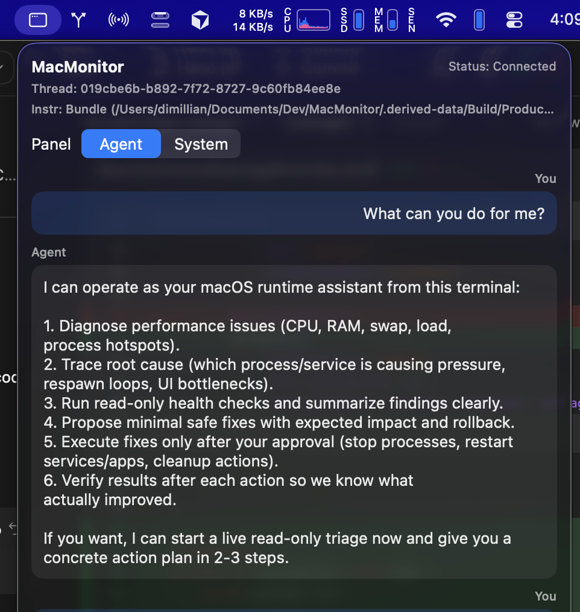
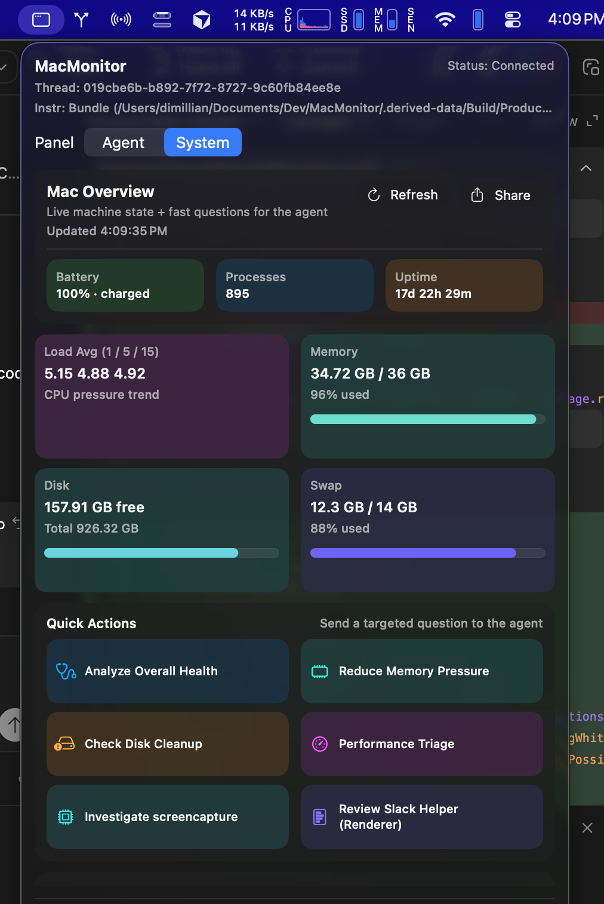

# MacMonitor

MacMonitor is a menubar-first macOS assistant powered by `codex app-server`.
It provides:

- A live conversation UI with a persistent Codex thread.
- Approval controls for command/file-change requests.
- Local machine telemetry (uptime, load average, memory, disk, and top processes).

## Screenshots

<table>
  <tr>
    <th>Agent Tab</th>
    <th>System Tab</th>
  </tr>
  <tr>
    <td></td>
    <td></td>
  </tr>
</table>

## Architecture

- `Sources/Client/CodexAppServerSession.swift`: JSON-RPC transport/session actor for `codex app-server`.
- `Sources/Store/ConversationStore.swift`: conversation state, thread lifecycle, streaming messages, approvals.
- `Sources/Store/MacSystemStore.swift`: periodic macOS telemetry snapshot collector.
- `Sources/Views/*`: MenuBar chat and status views.
- `AGENTS.md`: contributor/build contract for this repository.
- `Resources/AGENTS.md`: bundled runtime instruction profile injected as `developerInstructions` for newly created threads.

## Local Run

```bash
./run-menubar.sh
```

Stop app:

```bash
./stop-menubar.sh
```

## Build

```bash
TUIST_SKIP_UPDATE_CHECK=1 tuist build MacMonitor --configuration Debug
```
